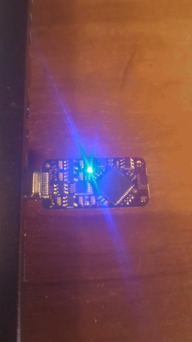

# tinygo-tkey

[](https://github.com/hybridgroup/tinygo-tkey/actions/workflows/build.yml)

This package is to develop applications using [TinyGo](https://tinygo.org/) on the [Tillitis TKey-1](https://github.com/tillitis/tillitis-key1), an open source, open hardware FPGA-based USB security token.

It includes an implementation of the [Tillitis framing protocol for communication](https://dev.tillitis.se/protocol/) between the device and client.

This can be used for device applications that run on the TKey hardware written using TinyGo. Of course, it pairs nicely with client applications written using "big" Go.

See the [`github.com/hybridgroup/tinygo-tkey/pkg/proto`](./pkg/proto/) package for more information.

## Examples

### Blinker



Example application for TKey written using TinyGo for the device application and Go for the client application.

#### Device application

To compile and flash the TKey with the device application:

```shell
tinygo flash -size short -target=tkey ./examples/blinker/app
```

The LED should start blinking green every half second.

#### Client application

Now you can run the command line client application on your computer:

```shell
go run ./examples/blinker/cmd --led 0 --timing 250
```

The LED should now be blinking blue every 250 ms.

### Signer

ed25519 signing tool that runs on the TKey hardware device.

It can be used by the [`tkey-ssh-agent`](https://github.com/tillitis/tkey-ssh-agent) application for SSH authentication, and by the [`tkey-sign`](https://github.com/tillitis/tkey-sign-cli) application for providing digital signatures of files. 

See the [README.md](./examples/signer/README.md) for more information.
